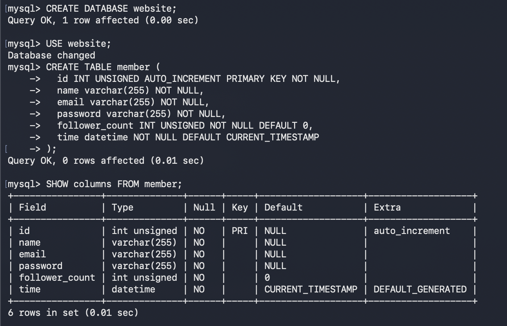
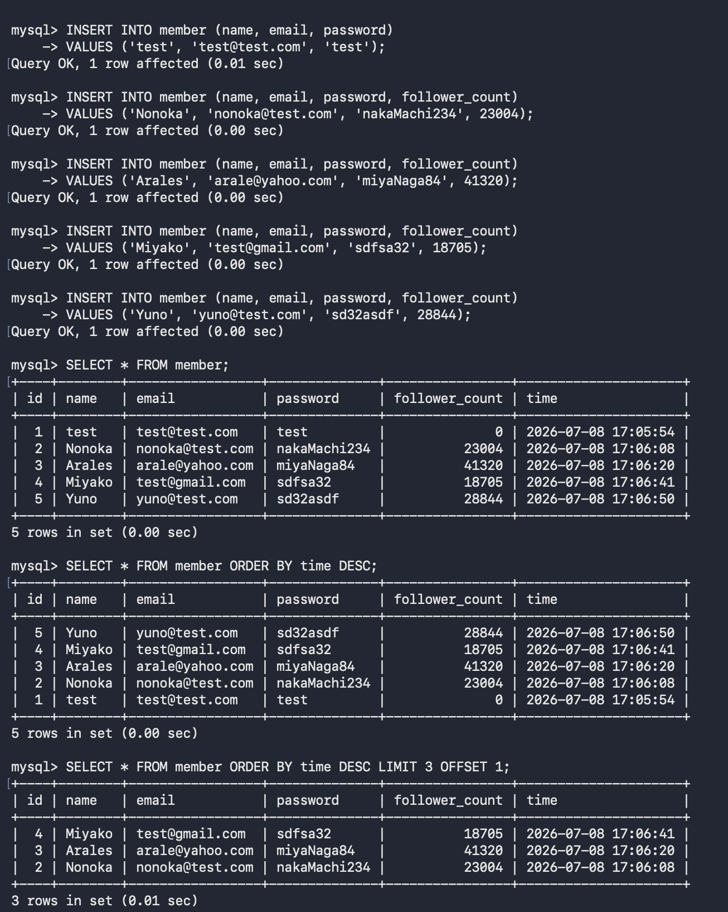
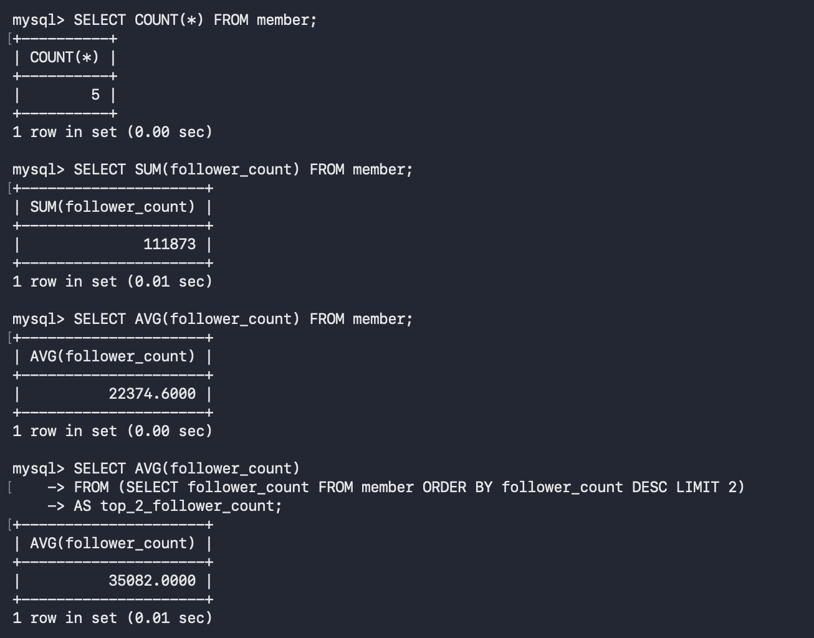
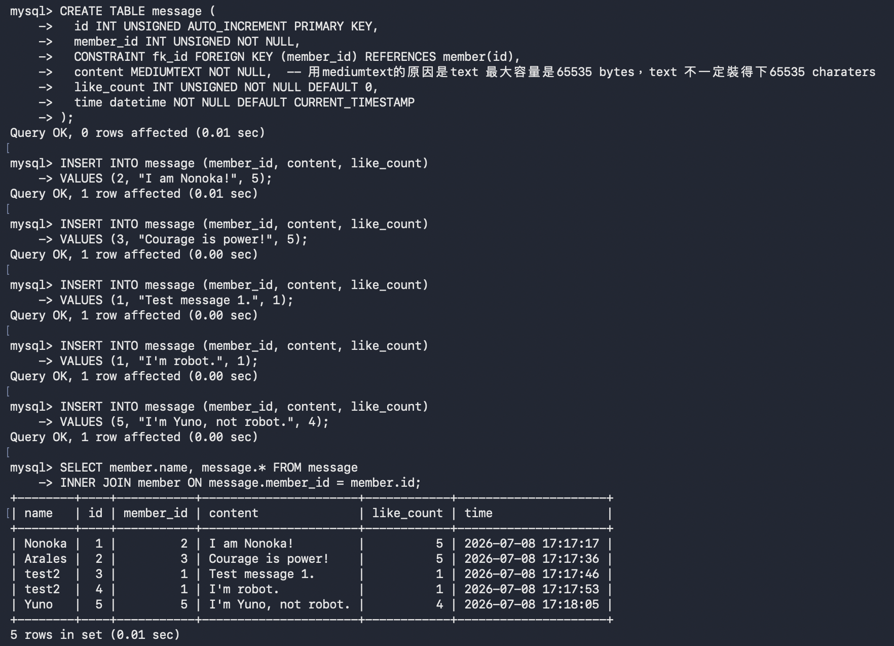
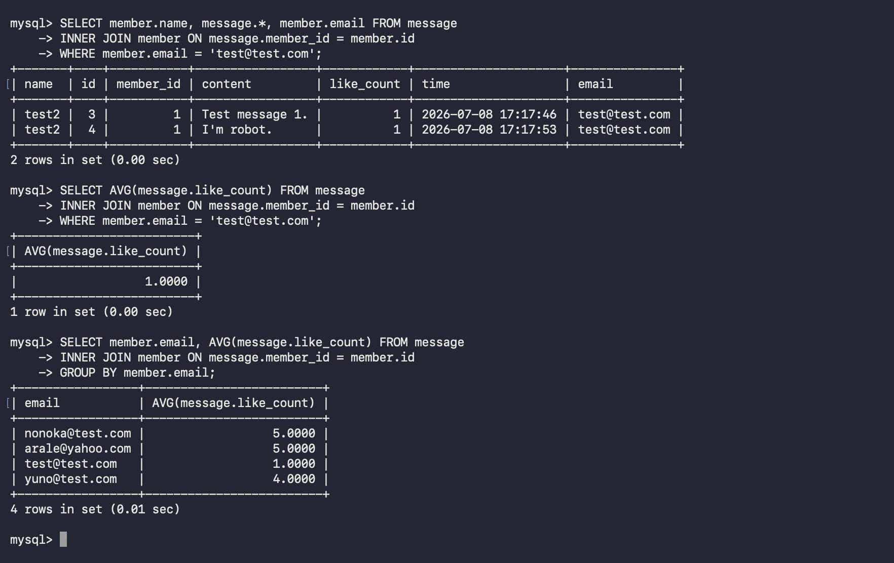

# Task 2

### SQL statement

```sql
CREATE DATABASE website;

USE website;

CREATE TABLE member (
  id INT UNSIGNED AUTO_INCREMENT PRIMARY KEY NOT NULL,
  name varchar(255) NOT NULL,
  email varchar(255) NOT NULL,
  password varchar(255) NOT NULL,
  follower_count INT UNSIGNED NOT NULL DEFAULT 0,
  time datetime NOT NULL DEFAULT CURRENT_TIMESTAMP
);

SHOW columns FROM member;
```



# Task 3

### SQL statement

```sql
INSERT INTO member (name, email, password)
VALUES ('test', 'test@test.com', 'test');
INSERT INTO member (name, email, password, follower_count)
VALUES ('Nonoka', 'nonoka@test.com', 'nakaMachi234', 23004);
INSERT INTO member (name, email, password, follower_count)
VALUES ('Arales', 'arale@yahoo.com', 'miyaNaga84', 41320);
INSERT INTO member (name, email, password, follower_count)
VALUES ('Miyako', 'test@gmail.com', 'sdfsa32', 18705);
INSERT INTO member (name, email, password, follower_count)
VALUES ('Yuno', 'yuno@test.com', 'sd32asdf', 28844);

SELECT * FROM member;
SELECT * FROM member ORDER BY time DESC;
SELECT * FROM member ORDER BY time DESC LIMIT 3 OFFSET 1;
SELECT * FROM member WHERE email = 'test@test.com';
SELECT * FROM member WHERE name LIKE '%es%';
SELECT * FROM member WHERE email = 'test@test.com' AND password = 'test';
UPDATE member SET name = 'test2' WHERE email = 'test@test.com';
SELECT * FROM member;
```




# Task 4

### SQL statement

```sql
SELECT COUNT(*) FROM member;
SELECT SUM(follower_count) FROM member;
SELECT AVG(follower_count) FROM member;
SELECT AVG(follower_count) 
FROM (SELECT follower_count FROM member ORDER BY follower_count DESC LIMIT 2)
AS top_2_follower_count;
```



# Task 5

### SQL statement

```sql
CREATE TABLE message (
  id INT UNSIGNED AUTO_INCREMENT PRIMARY KEY,
  member_id INT UNSIGNED NOT NULL, 
  CONSTRAINT fk_id FOREIGN KEY (member_id) REFERENCES member(id),
  content MEDIUMTEXT NOT NULL,  -- 用mediumtext的原因是text 最大容量是65535 bytes，text 不一定裝得下65535 charaters
  like_count INT UNSIGNED NOT NULL DEFAULT 0,
  time datetime NOT NULL DEFAULT CURRENT_TIMESTAMP
);

INSERT INTO message (member_id, content, like_count)
VALUES (2, "I am Nonoka!", 5);
INSERT INTO message (member_id, content, like_count)
VALUES (3, "Courage is power!", 5);
INSERT INTO message (member_id, content, like_count)
VALUES (1, "Test message 1.", 1);
INSERT INTO message (member_id, content, like_count)
VALUES (1, "I'm robot.", 1);
INSERT INTO message (member_id, content, like_count)
VALUES (5, "I'm Yuno, not robot.", 4);

SELECT member.name, message.* FROM message
INNER JOIN member ON message.member_id = member.id;
SELECT member.name, message.*, member.email FROM message
INNER JOIN member ON message.member_id = member.id
WHERE member.email = 'test@test.com';
SELECT AVG(message.like_count) FROM message
INNER JOIN member ON message.member_id = member.id
WHERE member.email = 'test@test.com';
SELECT member.email, AVG(message.like_count) FROM message
INNER JOIN member ON message.member_id = member.id
GROUP BY member.email;
```


